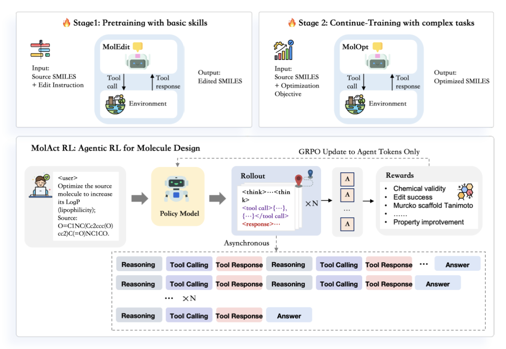
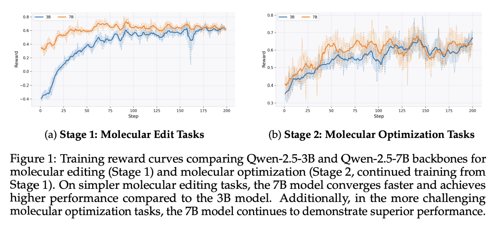
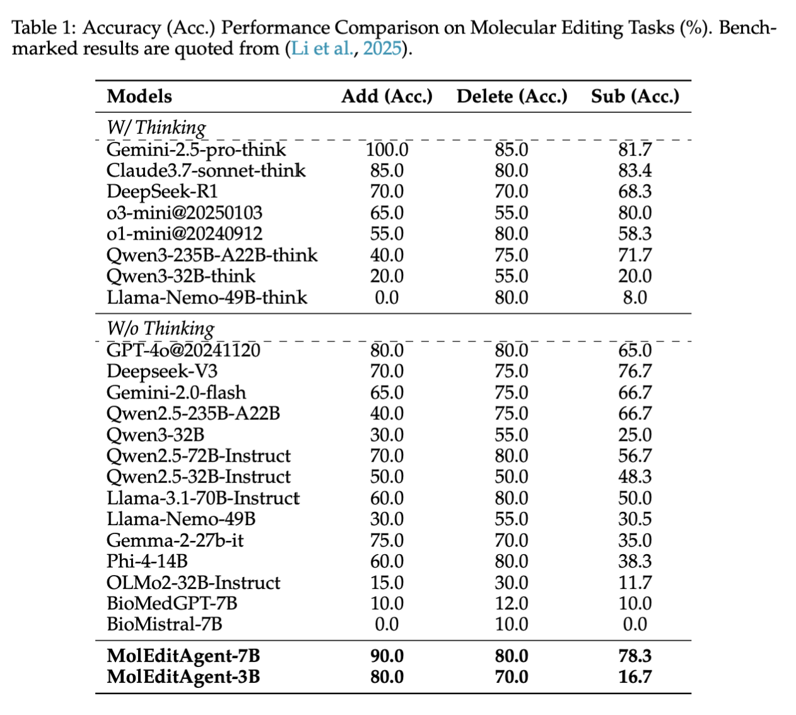
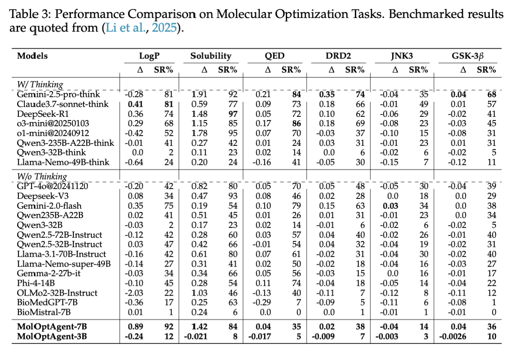

# MolAct: An Agentic RL Framework for Molecular Editing and Property Optimization

[](https://huggingface.co/collections/little1d/molact)
[](https://swanlab.cn/)

MolAct is an Agentic RL framework that trains LLMs to design molecules through a multi-turn "Think-Tool-Observation" loop. By leveraging GRPO and a two-stage training paradigm—mastering basic editing before tackling complex property optimization—MolAct learns to autonomously invoke chemical tools to ensure every modification is both physically valid and property-optimized.





## 📰 Latest News

- **2025-12-23**: 🎉 We released the inference code for MolAct! You can now run inference with our pre-trained models on molecular editing and optimization tasks.

## 🚀 Quick Start

### Installation

#### Step 1: Clone the Repository

```bash
git clone https://github.com/little1d/MolAct.git
cd MolAct
```

#### Step 2: Install AgentFly Framework

Please refer to the official [AgentFly installation guide](https://github.com/Agent-One-Lab/AgentFly/blob/main/docs/start/installation.md) for setup instructions.

#### Step 3: Install ChemCoTBench Evaluation Dependencies

For running evaluations on ChemCoTBench, install additional dependencies:

```bash
pip install python-Levenshtein nltk rouge-score selfies scikit-learn
```

Download NLTK data (required for evaluation metrics):

```bash
python -c "import nltk; nltk.download('wordnet', quiet=True); nltk.download('punkt', quiet=True)"
```

### Inference

We have open-sourced our training datasets and pre-trained models on [HuggingFace](https://huggingface.co/collections/little1d/molact). Please download the models before running inference.

#### Molecular Editing (MolEdit)

Run inference on molecular editing tasks using the provided script:

```bash
bash scripts/1\ run_mol_edit_inference.sh \
    [MODEL_DIR] [BENCH_DIR] [OUT_DIR]
```

The script will process all subtasks (add, delete, sub) automatically.

#### Molecular Optimization (MolOpt)

Run inference on molecular optimization tasks using the provided script:

```bash
bash scripts/3\ run_mol_opt_inference.sh \
    [MODEL_DIR] [BENCH_DIR] [OUT_DIR]
```

The script will process all subtasks (logp, drd, jnk, gsk, qed, solubility) automatically.

**Note**: When running inference scripts from the root directory, the TDC library will automatically download oracle files to the `oracle/` directory.

### Evaluation

Evaluate results on ChemCoTBench using the provided scripts:

```bash
# For molecular editing tasks
bash scripts/2\ eval_mol_edit_chemcotbench.sh \
    [BENCH_DIR] [PRED_DIR] [OUT_DIR]

# For molecular optimization tasks
bash scripts/4\ eval_mol_opt_chemcotbench.sh \
    [BENCH_DIR] [PRED_DIR] [OUT_DIR]
```

The scripts will automatically evaluate all subtasks (add/delete/sub for editing, logp/drd/jnk/gsk/qed/solubility for optimization) and save results in the output directory.

## 🛠️ Tools

The agents use a comprehensive set of chemistry tools for molecular manipulation and property calculation:

- **Molecular Validation**: Validate SMILES strings
- **Property Calculation**: Calculate molecular properties (logP, QED, solubility, etc.)
- **Molecular Editing**: Functional group transformations (addition, deletion, substitution) implemented via SMARTS-based pattern matching and modification
- **Scaffold Analysis**: Murcko scaffold extraction and similarity metrics
- **Oracle Scoring**: Protein activation scoring for optimization tasks (DRD-2, JNK-3, GSK-3β)

## 📊 Benchmark

We evaluate on [ChemCoTBench](https://github.com/IDEA-XL/ChemCoTBench) for both molecular editing and optimization tasks. ChemCoTBench is a comprehensive benchmark for step-wise reasoning on complex chemical problems.

### Supported Tasks

- **Molecular Editing**: Add, delete, and substitute functional groups
- **Molecular Optimization**: Optimize for physicochemical properties (QED, LogP, Solubility) and protein activation (DRD-2, JNK-3, GSK-3β)

### Results





## 📝 Citation

If you use MolAct in your research, please cite:

```bibtex
@article{molact2024,
  title={MolAct: Molecular Action Agents for Chemistry Tasks},
  author={Your Name},
  journal={Your Journal},
  year={2024}
}
```

## 🙏 Acknowledgments

We would like to thank the following projects and frameworks that made this work possible:

- **[SwanLab](https://github.com/SwanHubX/SwanLab)** for experiment tracking and visualization
- **[ChemCoTBench](https://github.com/IDEA-XL/ChemCoTBench)** for providing comprehensive benchmarks for molecular editing and optimization tasks
- **[AgentFly](https://github.com/Agent-One-Lab/AgentFly)** for the agentic RL framework infrastructure
